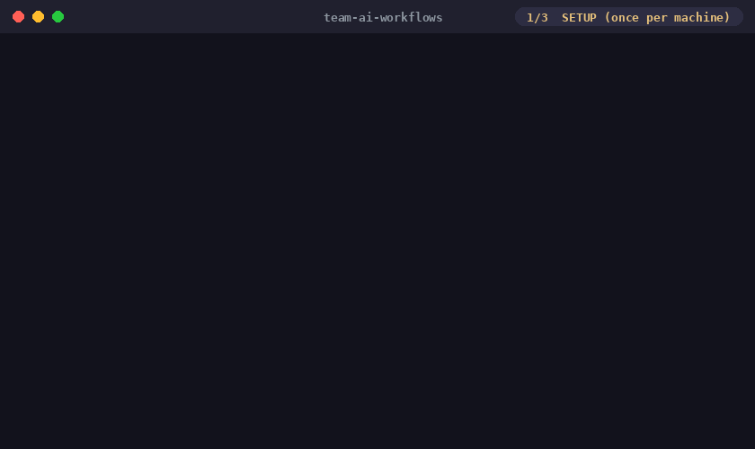

# team-ai-workflows

A template for distributing **Claude Code skills** and a **team knowledge base** through a single git repository.



- Onboarding is "clone, then run `/team-setup` once"
- After that, updates arrive with a plain **`git pull`** (a post-merge hook re-syncs skill links automatically)
- Skills are injected into the user level (`~/.claude/skills`) as one link per skill, so they work **in every project on the machine**
- Knowledge (`sources/`) is searchable from any project via the bundled `/docs-grep` skill — a "repository-shaped RAG" with no vector DB and no server

📖 Full design write-up (Japanese): [git pull だけでチーム全員の Claude Code が賢くなる](https://qiita.com/umezu_y/items/2b09fad5f2a96542f891) — covers the rationale, the trial and error behind this layout, and a comparison with the official plugin marketplace.

## Prerequisites

| Tool | Purpose |
|---|---|
| [Claude Code](https://docs.claude.com/en/docs/claude-code/overview) | Runs the skills (the core tool) |
| git | Distribution and updates |
| Python 3.x | Knowledge search script |

Works on Windows (Git Bash — uses junctions, no admin rights needed), macOS, and Linux (symlinks).

## Setup (once per machine)

```bash
git clone https://github.com/umezy/team-ai-workflows.git
cd team-ai-workflows
claude        # start Claude Code
```

Then, at the Claude Code prompt:

```
/team-setup
```

The AI walks you through the rest interactively. Restart your session afterwards and the skills appear in every project.

## Getting updates

```bash
git pull   # that's it — the post-merge hook re-syncs the skill links
```

## Layout

| Path | Role |
|---|---|
| `skills/` | Skills distributed to the team (one folder per skill). This is what gets linked into `~/.claude/skills` |
| `sources/` | Knowledge base (domain knowledge the LLM doesn't have). Searchable via `/docs-grep` |
| `.claude/skills/team-setup/` | The setup skill — visible only when Claude Code is started inside this repo |

## Bundled skills

| Skill | Summary |
|---|---|
| `/team-setup` | One-time machine setup: user-level skill links, post-merge hook, environment variable |
| `/docs-grep` | Multi-keyword search over `sources/`, ranked by relevance, with an answer synthesized from the top hits |

## Make it your team's

1. Fork or clone this repo onto your team's git hosting
2. Add your own skills under `skills/<skill-name>/SKILL.md`
3. Replace the samples in `sources/` with your team's knowledge (docs copies, API references, first-hand tips)
4. Tell members: "clone it and run `/team-setup`"

## License

MIT
